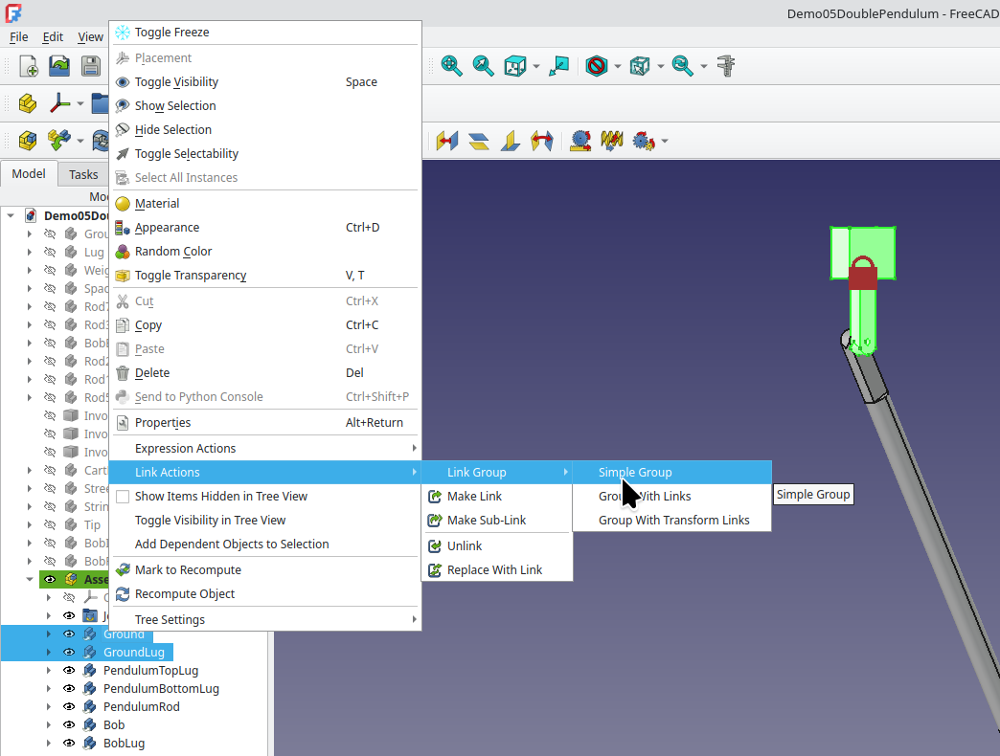
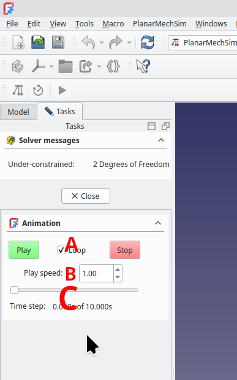

# PlanarMechSim

## A Planar Real-World Mechanical Simulator Workbench for FreeCAD&nbsp;1.1+

### For the Calculation and Simulation of the Real-World Dynamics of Planar Rigid-Body Mechanical Systems  [Previously "NikraDAP" for FreeCAD 0.x]</h3>

 
Simulation of the <em>actual motion</em> of a quadruple pendulum using PlanarMechSim

## Introduction

The **PlanarMechSim** FreeCAD WorkBench is a planar rigid body dynamics workbench that is based on the DAP solver algorithm developed by P.E.&nbsp;Nikravesh in his book: ** *PLANAR MULTIBODY DYNAMICS*: Formulation, Programming with MATLAB, and Applications**, 2nd Edition, *P.E.&nbsp;Nikravesh*, CRC&nbsp;Press, 2018

If a user has built a mechanism which allows motion of its components within only the **x-y** plane under the force of gravity acting in the **-Y** direction, then the entire assembly can be fed into **PlanarMechSim** which will then calculate the development of the positions of all its constituent bodies as a function of time.  The resultant movement of all the sub-bodies of the mechanism can then be viewed on the screen, or further graphically analysed using a spreadsheet.

Note that this workbench does **NOT** perform the same function as FreeCAD's built-in simulator.  Whereas in FreeCAD's simulator, the user selects which joint moves, when it moves, and at what speed it moves, **PlanarMechSim** uses the **physics** governing the motion of each part, and the forces acting upon it, to determine its motion.  **PlanarMechSim** simulates the <em>real-world</em> motion of a <em>real-world</em> collection of bodies under the <em>real-world</em> conditions that the user has selected.

## Running PlanarMechSim in a 7 step Nutshell

### Step 1
Create an assembly of objects using FreeCAD's Assembly workbench.  The assembly must be drawn so that any movement which the bodies will
exprience is in the X-Y plane. It is assumed that the assembly is under the influence of gravity in the **-Y** direction.   All of the joints used to assemble the assembly must be either:

» **Fixed** [**Welded**] joints,

» **Revolute** joints.

» **Slider** [**Translational**] joints,

» a **Distance** joint between a **Revolute** axis and a **Revolute** axis [**Revolute-Revolute** joint] or

» a **Distance** joint between a **Revolute** axis and a **Sliding** axis [**Pin in Slot** joint].

Disc and gear-like joints will be implemented soon.

The other joints available to the Assembly workbench allow motion in the third dimension, and are not applicable to a Planar Mechanical Simulator.

For example, we have created the following assembly:
  

### Step 2
Link all the **stationary** components in the assembly into a simple group.  It is important that the **first** linked group contain all the stationary components.

The linking process is illustrated in the following image: 
  

### Step 3
Link all the other components into simple groups - preferably with all the components in each solid body, linked into a group. It is not strictly necessary that sub-components joined with **Fixed** joints in the Assembly workbench, be joined together into a group.  PlanarMechSim is capable of handling **Fixed** joints without any trouble, with the components on each side of the fixed joint treated as two separate sub-bodies.  However, each **Fixed** joint which must be included in the calculations, increases the computation time.  Thus each **Fixed** joint which has been included inside a linked group, improves time efficiency.

### Step 4
Enter the PlanarMechSim workbench and press the left-most PlanarMechSim icon [].  The Simulation is initialised.  The linked groups will be renamed as **SimBodyXX**.  Two new containers will also be created, namely **SimGlobals** and **SimForces**, which will be used internally by the workbench.  Should it be required at some later time to re-initialise the workbench with new values, these two containers (and any ones below them) can simply be deleted and the initialise icon pressed again.

### Step 5
Press the second PlanarMechSim icon[].  The solver dialog box will open.

The various regions of the dialog box are as follows:

A: **Calculation Time**:  Values can be entered here to select the total length of time the simulation will run, and the time resolution at which it will be calculated.

B: **Accuracy**: This slider sets the measure of accuracy which will be used.  Low accuracy will cause larger errors in the results, which will sometimes be seen as joints coming slowly apart as time goes on.  Higher accuracy will give rise to a longer delay while the simulation is calculated.  As with all numerical methods, there is **no error-free** or perfectly accurate answer (*caveat lector*).  Deviations from the physical world will allways increase to some extent as the simulation time goes by.  The magnitude of these deviations are affected by the accuracy slider.

C: **Correct Initial Conditions**:  This will only be used, once further functionality has been added to the WorkBench -- including being able to attribute initial velocities to various bodies. The workbench is capable of determining whether a set of initial conditions actually make physical sense, and can attempt to adjust them accordingly.

D:  **Output Animation Only**:  If the user is only interested in qualitative results, where just an animation will suffice as output, then time can be saved in the calculations by checking this box.

E:  **Results Directory**:  If **Output Animation Only** is not selected, then the file name and location of the resulting spreadsheet file can be entered in this box.

F:  **Integration algorithms**:  Three differing integrators can be selected for the iterations of the solver.  The somewhat cryptic names will be self-evident to those who wish to select the non-default values.

G:  **Solve Button**: Pressing this button initiates the calculations.  Once completed, the dialog closes automatically.

### Step 6
Once the calculations are completed (which could take quite a few minutes), the solver dialog will close automatically.  Now press the third PlanarMechSim icon[].  The animation dialog box will open.

The various regions of the dialog box are as follows:

A:  Pressing these buttons start/stop the animation, which can also be requested to loop.

B:  This value affects the speed at which the animation is played.  The actual speed corresponding to **speed = 1.00**, is dependent on computer hardware, and hence this is only a qualitative setting.

C:  The actual time represented by the current animation image is shown in this area - both as a slider and an actual number.  The slider can be slid back and forth to set a stopped animation to a specific time.

### Step 7
If **Animation Only** has not been selected, a spreadsheet (in **.csv** format) will have been created in the directory specified.

The spreadsheet file which is generated, contains data for each of the moving bodies of the system, including the position, orientation, velocity, and acceleration of their respective centres of mass, and their associated joints.  Furthermore, the reaction forces on its various joints (sometimes known as **lambdas**) are tabulated, as well as the kinetic and potential energies of each of the moving bodies.  All of these values are tabulated for the entire length of time, and at the time resolution which has been selected.

Load the spreadsheet into your software of choice.  Much further numerical and graphical analysis of the data can now be performed inside the spreadsheet in the normal way.

It should be noted, that in order to compress the detailed spreadsheet maximally in the horizontal direction, body and joint name identifiers are displayed in cells using both horizontal and vertical formats.  The user may simply delete the row which contains the horizontal names, thereby enabling more columns of the spreadsheet to fit on a single screen.  Alternatively, the columns containing the names written vertically can be deleted, should they be too difficult to read.

Due to the variation in decimal point vs decimal comma conventions world-wide, the delimiter in the spreadsheet **.csv** file has been chosen to be a space.  Thus the space delimiter should be selected while importing the file into the spreadsheet.  If supported by your spreadsheet program, also tick **Merge Delimiters** or the equivalent, as sometimes more than one space separates two values.

By way of example, a spreadsheet window is reproduced below, showing the values of the reaction forces (lambdas) at a specific joint, and a graphical representation of the data as a function of time, as well as in **X-Y position** format.

## Demonstration Models

Demonstration models are available to illustrate some of the various situations which PlanarMechSim can simulate.  These can be found in the PlanarMechSim addon directory of your FreeCAD. In Linux, the add-on directory is often found at "**.local/share/FreeCAD/Mod/PlanarMechSim/** and hence the demo models can be found in "**.local/share/FreeCAD/Mod/PlanarMechSim/PlanarMechSim-Demo-Models/**.  Equivalent locations exist under **My Documents** in Windows distributions.  The exact location can depend on your distribution, and how you originally installed FreeCAD. Alternatively, the demo models can be found on github at https://github.com/cecilchurms/FreeCAD-PlanarMechSim/tree/master/PlanarMechSim-Demo-Models.

To run the demonstration, simply:

» load the model,

» enter the **PlanarMechSim** workbench,

» initialise the workbench with the [] icon,

» set up the solver parameters with the solver [] icon and

» calculate by pressing **Solve**.

Once the solver dialog closes, you may run the Animation to see the results [], or load the full data into your spreadsheet and visualise the results graphically or otherwise.

Various basic objects have been included in the demo models.  They appear at the top of the tree, before the **Assembler** container. Most of these objects are not used in the Demo models, but they are included for you to experiment with.

The objects stored in the Demo files are mostly made of Generic-Iron, but some are made of plactic or copper.  This is to illustrate **PlanarMechSim**'s capabilities to accurately handle and simulate objects while taking not only shape, but also density into account.

To change the density of a object, right-click on the object in the model tree, and select **Material**.  A list of pre-defined materials appears.  You may select one of the pre-loaded materials, or define your own custom material with its specific density as you wish, which can be stored for future use.

Demo's 03 and 04 demonstrate the density-awareness of **PlanarMechSim**.  In both cases, the left-hand pendulum bob is made of plastic, and the rightmost one of copper.  The difference between the analsis and motion of a simple pendulum (Demo 03) and a compound pendulum (Demo 04) under these conditions of differing density, is illustrated.

It is wise to make sure that the density of all your sub-parts is specified at the time when you create or assemble them.

## Saving models

When saving or re-initialising and running PlanarMechSim again with another configuration or with altered data, it is wise to delete all the containers in your model tree from **SimGlobals** downwards.  This is specially true when you have saved a model which has already  been simulated, as the data included in the **SimGlobals** container and below, are not saved and re-loaded by FreeCAD in their entirety and can confuse **PlanarMechSim** on subsequent runs.  Simply delete **SimGlobals** and below, and press the initialise icon of PlanarMechSim before re-running it.

## Future plans

PlanarMechSim is a living project.  In time, all the planar joints of FreeCAD's assembly workbench will be implemented seamlessly.

Furthermore, whereas at present, gravity is the only force acting on the system, the implementation of other forces (e.g. springs, dampers) will be rolled out in the future.

The posssibility of including periodic input drivers of bodies in the system, is also in the pipe-line.  This will enable the much-desired analysis of resonances. 

 
Watch this space --- PlanarMechSim is growing

# ---------------------------------------
Cecil Churms, 
Johannesburg, 
South Africa.  
Last updated: 4th March 2026 

