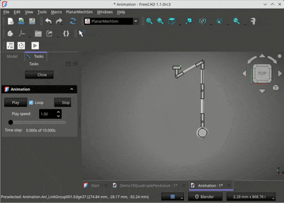
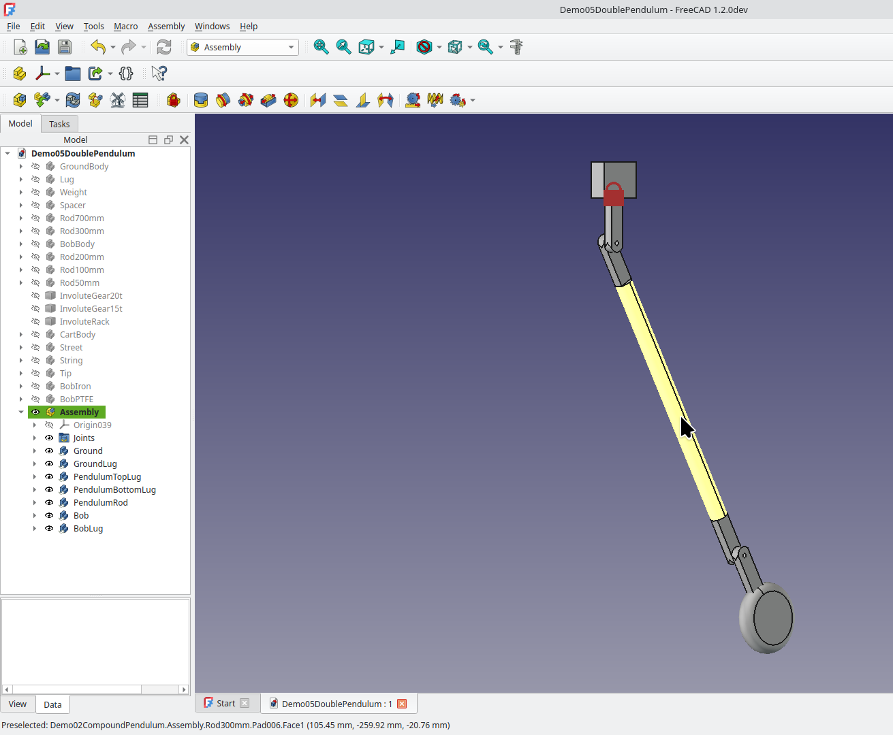
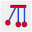
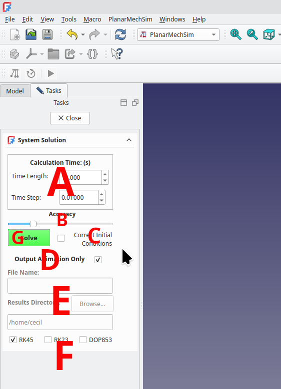
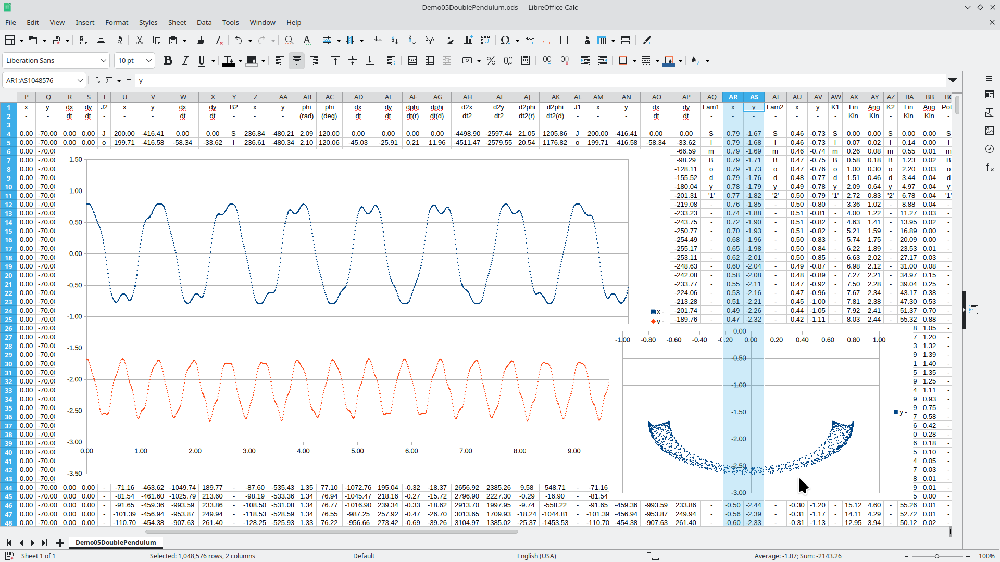

# <h1>PlanarMechSim</h1>
# <h2>A Planar Mechanical Simulator Workbench for FreeCAD&nbsp;1.x</h2>
# <h3>Calculation and Simulation of the Dynamics of Planar Multibody Mechanical Systems</h3>

# <h3>[Previously "NikraDAP" for FreeCAD 0.x]</h3>

The <em>PlanarMechSim</em> FreeCAD WorkBench is a planar multibody dynamics workbench that is based on the DAP solver algorithm developed by P.E.&nbsp;Nikravesh in his book: <em>PLANAR MULTIBODY DYNAMICS: Formulation, Programming with MATLAB, and Applications</em>, 2nd Edition, *P.E.&nbsp;Nikravesh*, CRC&nbsp;Press, 2018  
  

# <h3>Running PlanarMechSim in a 7 step Nutshell</h3>

# <h4>Step 1</h4>
Create an assembly of objects using FreeCAD's Assembly workbench.  The assembly must be drawn so that any movement which the bodies will
exprience is in the X-Y plane.  All of the joints used to assemble the assembly must be either <em>Fixed</em> [<em>Welded</em>] joints, <em>Revolute</em> joints. <em>Slider</em> [<em>Translational</em>] joints, or a <em>Distance</em> joint between a <em>Revolute</em> axis and a <em>Revolute</em> axis [<em>Revolute-Revolute</em> joint] or a <em>Distance</em> joint between a <em>Revolute</em> axis and a <em>Sliding</em> axis [<em>Pin in Slot</em> joint].  Some other joints available to the Assembly workbench allow motion along a third axis, and are not applicable to a Planar Mechanical Simulator.  Disc and gear-like joints will be implemented soon.

For example, we have created the following assembly: 
  

# <h4>Step 2</h4>
Link all the stationary components in the assembly into a simple group.  It is important that the <em>first</em> linked group contain all the stationary components.

The linking process is illustrated in the following image: 
  

# <h4>Step 3</h4>
Link all the other components into groups - preferably with all the components in one solid body, linked into one group.  It should
be noted that it is not strictly necessary that components joined with <em>Fixed</em> joints in the Assembly workbench must all be joined together into the same group.  PlanarMechSim is capable of handling <em>Fixed</em> joints without any trouble.  However, each <em>Fixed</em> joint which must be included in the calculations, increases the time required for the calculations.  Thus each <em>Fixed</em> joint which has been included inside a linked group, improves time efficiency.

# <h4>Step 4</h4>
Enter the PlanarMechSim workbench and press the first PlanarMechSim icon [].  The Simulation is initialised.  It can be seen that the linked groups have been renamed as <em>SimBody</em>XX.  Two new containers have also been created, namely <em>SimGlobals</em> and <em>SimForces</em>.  Should it be required to re-initialise the workbench, these two containers (and any ones below them) can simply be deleted and the icon pressed again.

# <h4>Step 5</h4>
Press the second PlanarMechSim icon[].  The solver dialog box will open.  The various regions of the dialog box are as follows:  

  
A: <em>Calculation Time</em>:  Values can be entered here for the total length of time the simulation will run, and the
time resolution at which it will be calculated

B: <em>Accuracy</em>: This slider sets the measure of accuracy which will be used.  Low accuracy will cause larger errors
in the results, which will typically be seen as joints coming slowly apart as time goes on.  Higher accuracy will
obviously give rise to a longer delay while the simulation is calculated.  As with all numerical methods, there is no <em>error-free</em>
answer (<em>caveat lector</em>).  Deviations from the physical world will increase as the simulation time goes by.  The magnitude 
of these deviations are affected by the accuracy slider.

C: <em>Correct Initial Conditions</em>:  This will be used once more functionality has been added to the WorkBench
including being able to attribute initial velocities to various bodies.

D:  <em>Output Animation Only</em>:  If the user is only interested in qualitative results, where just an animation will suffice,
then time can be saved in the calculations.

E:  <em>Results Directory</em>:  If <em>Output Animation Only</em> is not selected, then the file name and location of the resulting
spreadsheet file can be enetered in this box

F:  <em>Integration algorithms</em>:  Three differing integrators can be selected for the iterations of the solver.  The somewhat cryptic
names will be self-evident to those who have sufficient knowledge to want to select the non-default values.

G:  <em>Solve Button</em>: Pressing this button initiates the calculations.  Once completed, the dialog closes automatically.

# <h4>Step 6</h4>
Once the calculations are completed (which could take quite a few minutes), the solver dialog will close automatically.  Now press the third PlanarMechSim icon[].  The animation dialog box will open.  The various regions of the dialog box are as follows:  
  
A:  Pressing these buttons start/stop the animation which can be selected to loop as well.

B:  This value affects the speed at which the animation is played.  The speed=1.00 speed is dependent on the computer hardware, and so
this is only a qualitative setting.

C:  The actual time represented by the current animation image is shown in this area - both as a slider and an actual number.  The
slider can be used to set a stopped animation to a specific time.

# <h4>Step 7</h4>
If <em>Animation Only</em> has not been selected, a spreadsheet (in <em>.csv</em> format) will have been created in the directory
specified.  Load the spreadsheet into your software of choice.  This spreadsheet contains detailed data on the exact movements of all the bodies at all the time intervals selected.  Much further numerical and graphical analysis of the data can now be performed in the spreadsheet. It should be noted, that in order to compress the detailed spreadsheet maximally in the horizontal direction, some body name identifiers etc. are duplicated in cells using both horizontal and vertical formats.  The user can simply delete the entries not required.

Due to the decimal point vs decimal comma variations world-wide, the delimiter in the file has been chosen to be a space.  If supported by your spreadsheet program, also tick <em>Merge Delimiters</em> or the equivalent, as sometimes more than one space separates two values.

By way of example, a spreadsheet window is reproduced below, showing the values of the reaction forces (lambdas) at a specific joint, and a graphical representation of the data.  
  

Demonstration models are available to illustrate some of the various situations which PlanarMechSim can simulate.  These can be found in the PlanarMechSim addon directory of your FreeCAD. In Linux they are often found in "**.local/share/FreeCAD/Mod/PlanarMechSim/PlanarMechSim-Demo-Models/**, with a similar location under **My Documents** in Windows distributions.  The exact location can depend on your distribution, and how you installed FreeCAD.  Simply load the model, enterter the PlanarMechSim workbench, initialise the workbench with the [] icon, set up the solver paramerters with the solver [] icon and calculate by pressing **Solve**.  Once the solver dialog closes, you may run the Animation to see the results, or load the full data into your spreadsheet and visualise the results graphically or otherwise.

A whole lot of various objects have been created, and included in the demo models.  They appear at the top of the tree, before the **Assembler** container. Most of these objects are not used in the Demo models, but they are included for you to experiment with.

The objects stored in the Demo files are mostly made of Generic-Iron, but some are made of plactic or copper.  This is to illustrate PlanarMechSim's capabilities to accurately handle and simulate objects of any density.  To change the density of a object, right-click on the object in the model tree, and select **Material**.  A list of pre-defined materials appears.  You may define your own custom material with its specific density as you wish.  It can be stored for future use.  Demo's 03 and 04 demonstrate the density-awareness of PlanarMechSim.  The left-hand pendulum bob is made of plastic, and the rightmost one of copper.  It is wise to make sure that the density of all your sub-parts is specified when you create or assemble them.

It is wise to delete all the containers in your model from **SimGlobals** downwards, before saving or re-initialising and running PlanarMechSim again with another configuration.  This is specially true when you have saved a model which has already  been simulated, as the **SimGlobals** and below, containers are not saved and re-loaded in their entirety.  Simply delete **SimGlobals** and below, and press the re-initialise icon of PlanarMechSim before re-running it.

# <h3>Future plans</h3>
PlanarMechSim is a living project.  In time, all the planar joints of FreeCAD's assembly workbench will be implemented seamlessly.  Furthermore, whereas at present, gravity is the only force acting on the system, the implementation of many other forces (e.g. springs, dampers etc) will be rolled out in the future.

<em>Watch this space</em>

  
<em>Please be patient:  The software and documentation is still in the process of development.</em>
# ---------------------------------------
Cecil Churms, 
Johannesburg, 
South Africa.  
Documentation Last updated: 3rd March 2026 

